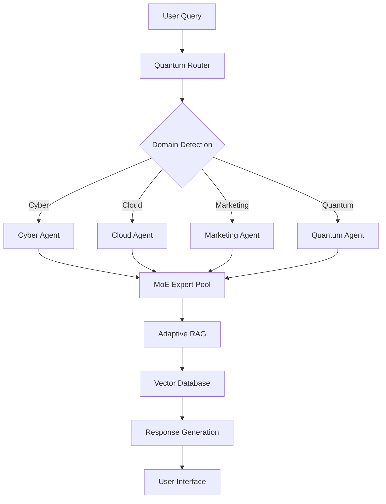
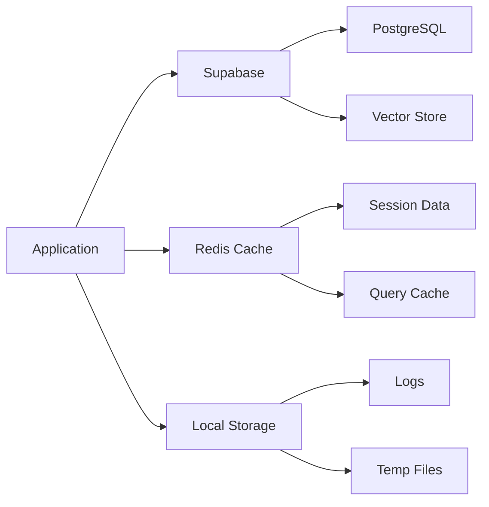
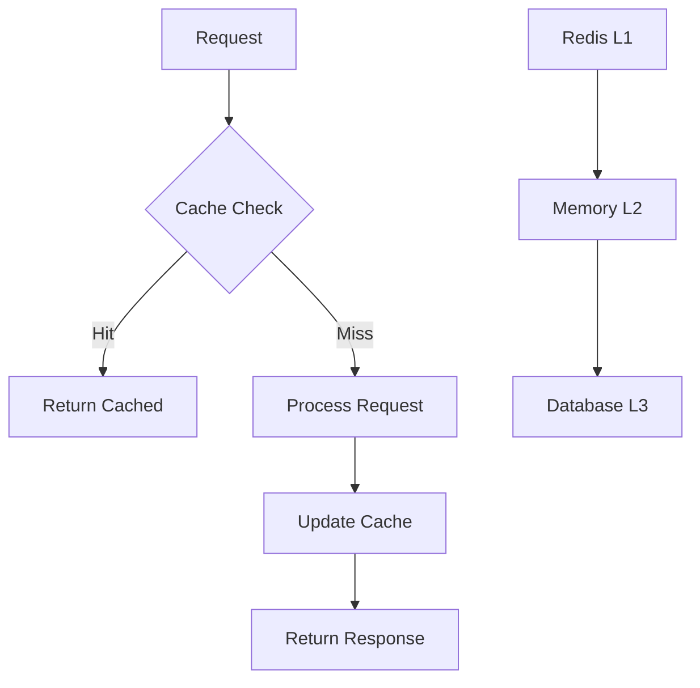

# Quantum MoE MAS Architecture

## Overview

The Quantum-Infused Mixture of Experts Multi-Agent System (MAS) is designed as a sophisticated, enterprise-grade AI orchestration platform that combines cutting-edge AI techniques with robust infrastructure and security practices.

## System Architecture

### High-Level Architecture

```
┌─────────────────────────────────────────────────────────────┐
│                    User Interface Layer                     │
│  ┌─────────────┐  ┌─────────────┐  ┌─────────────────────┐ │
│  │  Streamlit  │  │  FastAPI    │  │  Web Interface      │ │
│  │  Dashboard  │  │  Gateway    │  │                     │ │
│  └─────────────┘  └─────────────┘  └─────────────────────┘ │
└─────────────────────────────────────────────────────────────┘
                              │
┌─────────────────────────────────────────────────────────────┐
│                 Orchestration Layer                         │
│  ┌─────────────┐  ┌─────────────┐  ┌─────────────────────┐ │
│  │  Quantum    │  │    MAS      │  │   Genetic Evolution │ │
│  │  Router     │  │Orchestrator │  │      Engine         │ │
│  └─────────────┘  └─────────────┘  └─────────────────────┘ │
└─────────────────────────────────────────────────────────────┘
                              │
┌─────────────────────────────────────────────────────────────┐
│                    Agent Layer                              │
│  ┌─────────────┐  ┌─────────────┐  ┌─────────────────────┐ │
│  │   Cyber     │  │   Cloud     │  │    Marketing        │ │
│  │   Agent     │  │   Agent     │  │     Agent           │ │
│  └─────────────┘  └─────────────┘  └─────────────────────┘ │
│  ┌─────────────┐                                           │
│  │  Quantum    │                                           │
│  │   Agent     │                                           │
│  └─────────────┘                                           │
└─────────────────────────────────────────────────────────────┘
                              │
┌─────────────────────────────────────────────────────────────┐
│                Intelligence Layer                           │
│  ┌─────────────┐  ┌─────────────┐  ┌─────────────────────┐ │
│  │    MoE      │  │  Adaptive   │  │    Vector           │ │
│  │Expert Pool  │  │    RAG      │  │   Database          │ │
│  └─────────────┘  └─────────────┘  └─────────────────────┘ │
└─────────────────────────────────────────────────────────────┘
```

## Core Components

### 1. Quantum Router

The Quantum Router implements quantum-inspired probabilistic routing for optimal expert selection:

- **Sparse Activation**: Only 37B parameters active out of 671B total per token
- **Quantum-Probabilistic Gating**: Uses superposition states for expert selection
- **Dynamic Load Balancing**: Distributes load across expert pool
- **Confidence Scoring**: 0-100% confidence with 80%+ threshold

### 2. Multi-Agent System (MAS) Orchestrator

Coordinates multiple specialized agents:

- **Task Distribution**: Intelligent task routing to appropriate agents
- **Conflict Resolution**: Handles competing agent recommendations
- **Workflow Management**: Manages complex multi-agent workflows
- **Performance Monitoring**: Tracks agent performance and efficiency

### 3. Adaptive Multi-Modal RAG

Provides intelligent retrieval across multiple content types:

- **Multi-Modal Processing**: Text, images, PDFs, videos
- **Hybrid Search**: Vector + graph search for optimal retrieval
- **Context Preservation**: Maintains context across modalities
- **Adaptive Learning**: Improves based on user feedback

### 4. Domain-Specialized Agents

#### Cyber Agent
- CEH v12 compliant security analysis
- OSINT capabilities
- Threat intelligence processing
- Vulnerability assessment

#### Cloud Agent
- Multi-cloud orchestration (AWS, GCP, Azure)
- Infrastructure as Code deployment
- Auto-scaling and optimization
- Cost monitoring and optimization

#### Marketing Agent
- HubSpot CRM integration
- ROI calculation and optimization
- Campaign performance analysis
- Customer journey mapping

#### Quantum Agent
- IBM Qiskit integration
- Quantum algorithm optimization
- Quantum-classical hybrid processing
- Quantum machine learning

## Data Flow

### Query Processing Flow



### Data Storage Architecture



## Security Architecture

### Security Layers

1. **Network Security**
   - TLS/SSL encryption
   - API rate limiting
   - CORS protection
   - Firewall rules

2. **Application Security**
   - JWT authentication
   - Role-based access control
   - Input validation
   - SQL injection prevention

3. **Data Security**
   - Encryption at rest
   - Encryption in transit
   - PII anonymization
   - Audit logging

4. **Infrastructure Security**
   - Container security
   - Secrets management
   - Vulnerability scanning
   - Security monitoring

## Performance Optimization

### Caching Strategy



### Load Balancing

- **Horizontal Scaling**: Multiple application instances
- **Expert Pool Balancing**: Dynamic load distribution
- **Database Sharding**: Distributed data storage
- **CDN Integration**: Static asset optimization

## Monitoring and Observability

### Metrics Collection

1. **Application Metrics**
   - Request latency
   - Error rates
   - Throughput
   - Resource utilization

2. **Business Metrics**
   - ROI calculations
   - Efficiency gains
   - User satisfaction
   - Cost optimization

3. **Security Metrics**
   - Authentication attempts
   - Authorization failures
   - Suspicious activities
   - Data access patterns

### Logging Strategy

- **Structured Logging**: JSON format for machine processing
- **Context Injection**: Request IDs, user IDs, session IDs
- **Log Levels**: DEBUG, INFO, WARNING, ERROR, CRITICAL
- **Log Aggregation**: Centralized log collection and analysis

## Deployment Architecture

### Container Orchestration

```yaml
# Kubernetes deployment example
apiVersion: apps/v1
kind: Deployment
metadata:
  name: quantum-moe-mas
spec:
  replicas: 3
  selector:
    matchLabels:
      app: quantum-moe-mas
  template:
    metadata:
      labels:
        app: quantum-moe-mas
    spec:
      containers:
      - name: quantum-moe-mas
        image: quantum-moe-mas:latest
        ports:
        - containerPort: 8000
        env:
        - name: ENVIRONMENT
          value: "production"
```

### CI/CD Pipeline

1. **Source Control**: Git-based workflow
2. **Build Stage**: Docker image creation
3. **Test Stage**: Automated testing suite
4. **Security Scan**: Vulnerability assessment
5. **Deploy Stage**: Rolling deployment
6. **Monitor Stage**: Health checks and monitoring

## Scalability Considerations

### Horizontal Scaling

- **Stateless Design**: No server-side session storage
- **Database Sharding**: Distributed data storage
- **Microservices**: Independent service scaling
- **Load Balancing**: Traffic distribution

### Vertical Scaling

- **Resource Optimization**: CPU and memory tuning
- **Database Optimization**: Query optimization and indexing
- **Caching**: Multi-level caching strategy
- **Connection Pooling**: Database connection management

## Future Architecture Enhancements

### Planned Improvements

1. **Edge Computing**: Deploy agents closer to users
2. **Federated Learning**: Distributed model training
3. **Quantum Computing**: Real quantum hardware integration
4. **AI Model Optimization**: Custom model fine-tuning
5. **Advanced Analytics**: Predictive analytics and ML ops

### Technology Roadmap

- **Phase 1**: Core system implementation
- **Phase 2**: Advanced AI features
- **Phase 3**: Quantum computing integration
- **Phase 4**: Edge deployment and optimization
- **Phase 5**: Enterprise features and compliance

This architecture provides a solid foundation for building a scalable, secure, and maintainable AI orchestration platform that can grow with business needs and technological advances.